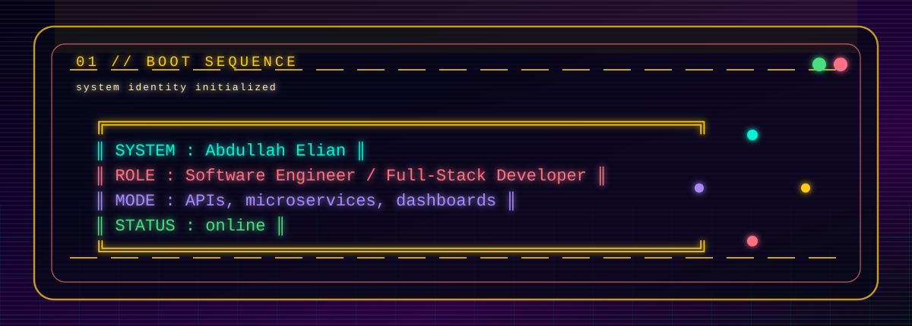
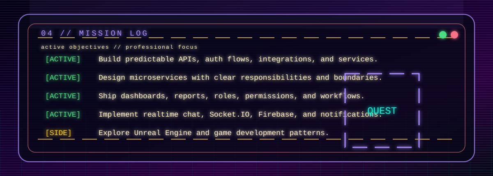
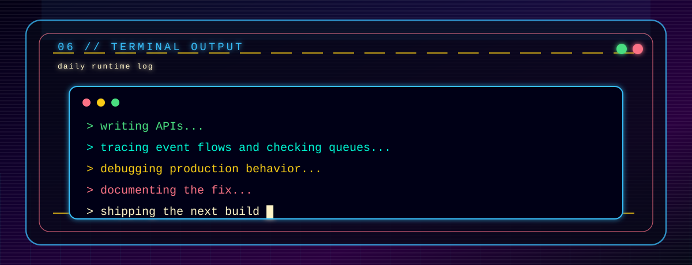
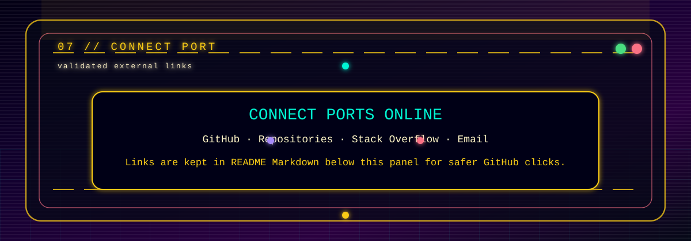

<a id="top"></a>

<div align="center">


<br />

<a href="#boot-sequence">BOOT</a> ·
<a href="#core-signal">CORE SIGNAL</a> ·
<a href="#tech-grid">TECH GRID</a> ·
<a href="#mission-log">MISSION LOG</a> ·
<a href="#save-files">SAVE FILES</a> ·
<a href="#terminal-output">TERMINAL</a> ·
<a href="#connect-port">CONNECT</a>

<br />
<br />

<code>SOFTWARE ENGINEER</code> · <code>FULL-STACK DEVELOPER</code> · <code>MICROSERVICES</code> · <code>REAL-TIME SYSTEMS</code>

</div>

---

<a id="boot-sequence"></a>



<div align="right"><a href="#top">▲ back to top</a></div>

---

<a id="core-signal"></a>


<div align="right"><a href="#top">▲ back to top</a></div>

---

<a id="tech-grid"></a>


<div align="right"><a href="#top">▲ back to top</a></div>

---

<a id="mission-log"></a>



<div align="right"><a href="#top">▲ back to top</a></div>

---

<a id="save-files"></a>


<div align="right"><a href="#top">▲ back to top</a></div>

---

<a id="terminal-output"></a>



<div align="right"><a href="#top">▲ back to top</a></div>

---

<a id="connect-port"></a>



<div align="center">

<a href="https://github.com/abdullah6516">GitHub</a> ·
<a href="https://github.com/abdullah6516?tab=repositories">Repositories</a> ·
<a href="https://stackoverflow.com/users/13602522/abdallah-ellian">Stack Overflow</a> ·
<a href="mailto:abdullahelian334@gmail.com">Email</a>

</div>

---

<div align="center">

```txt
END OF LINE // KEEP SHIPPING // DEBUG THE IMPOSSIBLE
```

</div>
