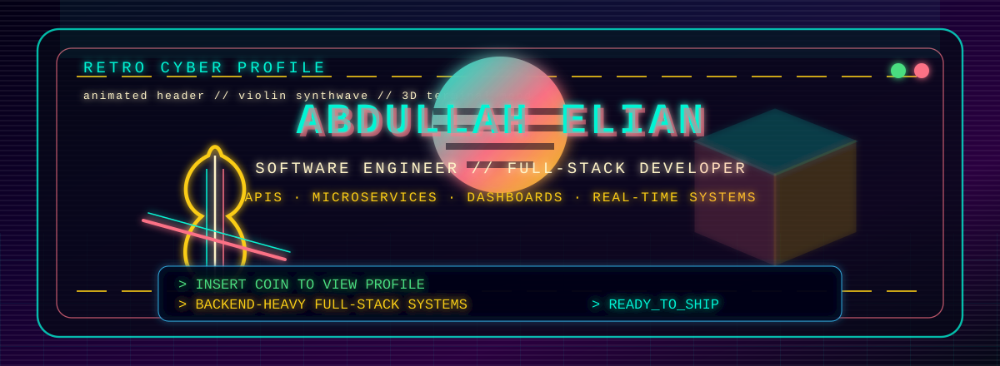
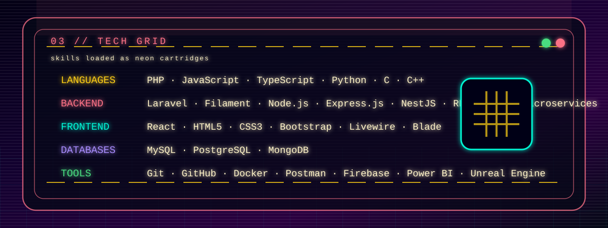
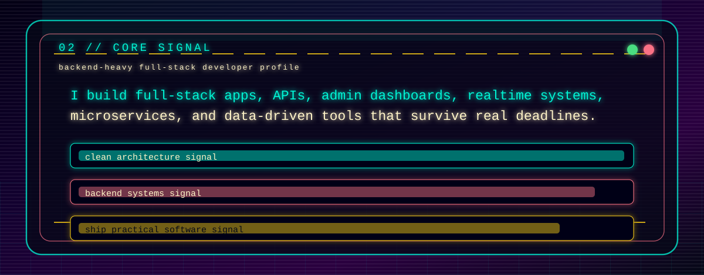
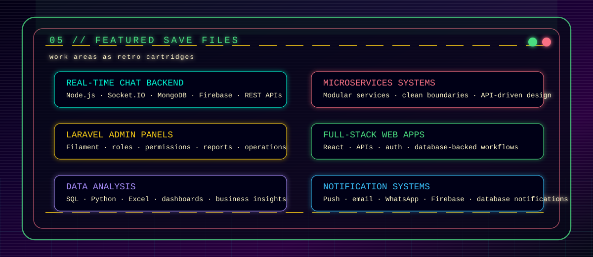

## Abdullah Elian

**Software Engineer** · **Full-Stack Developer** · **Microservices Architecture** · **Real-Time Systems**

---

### 📋 Navigation

[About](#about) · [Skills](#skills) · [Experience](#experience) · [Projects](#projects) · [Contact](#contact)

---

## About

Full-stack software engineer focused on building scalable backend systems, clean APIs, admin panels, real-time features, and cloud-ready applications.

I work across backend, frontend, and system design, with strong experience in Laravel, Node.js, NestJS, React, databases, microservices, and real-time communication systems.

I care about writing maintainable code, designing practical architecture, and turning business requirements into reliable software.

---

## Skills

---

## Experience

Professional work includes private company repositories, with **500+ contributions** across backend development, Laravel systems, APIs, admin panels, production features, and real-time application work.

Most professional contributions are maintained under a separate work GitHub profile due to company repository privacy.

---

## Projects

I use this personal GitHub profile to share personal projects, experiments, learning repositories, and public work related to software engineering.

**View all projects:** [GitHub Repositories](https://github.com/abdullah6516?tab=repositories)

---

## Contact & Links

| Platform | Link |
|----------|------|
| **Personal GitHub** | [github.com/abdullah6516](https://github.com/abdullah6516) |
| **Work GitHub** | [Elian-Jordan-clouds](https://github.com/Elian-Jordan-clouds) — 500+ professional contributions |
| **Stack Overflow** | [Stack Overflow Profile](https://stackoverflow.com/users/13602522/abdallah-ellian) |
| **Email** | [abdullahelian334@gmail.com](mailto:abdullahelian334@gmail.com) |

---

**© 2026 Abdullah Elian** · All Rights Reserved

