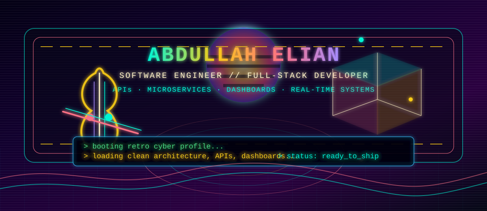

<a id="top"></a>

<div align="center">



<br />

<a href="#boot-sequence">BOOT</a> ·
<a href="#core-signal">CORE SIGNAL</a> ·
<a href="#tech-grid">TECH GRID</a> ·
<a href="#mission-log">MISSION LOG</a> ·
<a href="#save-files">SAVE FILES</a> ·
<a href="#connect-port">CONNECT</a>

<br />
<br />

<code>SOFTWARE ENGINEER</code> &nbsp; 
<code>FULL-STACK DEVELOPER</code> &nbsp; 
<code>BACKEND-HEAVY</code> &nbsp; 
<code>MICROSERVICES</code>

</div>

---

<a id="boot-sequence"></a>

## 01 // BOOT SEQUENCE 🎻

```txt
╔══════════════════════════════════════════════════════════════╗
║  SYSTEM       : Abdullah Elian                              ║
║  ROLE         : Software Engineer / Full-Stack Developer     ║
║  BASE         : Jordan                                       ║
║  MODE         : Retro cyber terminal                         ║
║  SPECIALTY    : APIs, microservices, dashboards, realtime    ║
║  STATUS       : Online                                       ║
╚══════════════════════════════════════════════════════════════╝
```

I'm a **Software Engineer** and **Full-Stack Developer** who builds **full-stack web applications, APIs, admin dashboards, real-time systems, microservices, and data-driven solutions**.

I lean backend-heavy, but I stay close enough to the frontend to ship complete products instead of disconnected parts.

<div align="right"><a href="#top">▲ back to top</a></div>

---

<a id="core-signal"></a>

## 02 // CORE SIGNAL ⚡

```txt
> clean architecture detected
> backend services initialized
> database layer synchronized
> realtime channel listening
> dashboard interface rendering
> production chaos probability: always above zero
```

I care about practical architecture, readable code, reliable systems, and software that survives real users, real data, and real deadlines. A modest goal, apparently, in an industry where “it works on my machine” is still treated like a legal defense.

| Signal | Focus |
| --- | --- |
| `API-01` | RESTful APIs, auth flows, integrations, backend services |
| `SYS-02` | Microservices, modular boundaries, scalable architecture |
| `DASH-03` | Admin dashboards, reports, roles, permissions, workflows |
| `RT-04` | Real-time chat, notifications, Socket.IO, Firebase flows |
| `DB-05` | Database design, query optimization, data reporting |
| `EXP-06` | Unreal Engine and game development experiments |

<div align="right"><a href="#top">▲ back to top</a></div>

---

<a id="tech-grid"></a>

## 03 // TECH GRID 🕹️

### Languages

`PHP` `JavaScript` `TypeScript` `Python` `C` `C++`

### Backend

`Laravel` `Filament` `Node.js` `Express.js` `NestJS` `REST APIs` `Microservices`

### Frontend

`React` `HTML5` `CSS3` `Bootstrap` `Livewire` `Blade`

### Databases

`MySQL` `PostgreSQL` `MongoDB`

### Tools & Platforms

`Git` `GitHub` `Docker` `Postman` `Firebase`

### Data & BI

`SQL` `Excel` `Power BI` `Python for Data`

### Game Development

`Unreal Engine`

<div align="right"><a href="#top">▲ back to top</a></div>

---

<a id="mission-log"></a>

## 04 // MISSION LOG 🧩

```txt
[ACTIVE] Build APIs that are predictable, documented, and maintainable.
[ACTIVE] Design services with clear responsibilities and sane boundaries.
[ACTIVE] Ship dashboards that help people manage actual workflows.
[ACTIVE] Implement realtime systems without turning the codebase into soup.
[ACTIVE] Convert messy data into reports, dashboards, and decisions.
[SIDE]  Explore gameplay systems and Unreal Engine development.
```

<div align="right"><a href="#top">▲ back to top</a></div>

---

<a id="save-files"></a>

## 05 // FEATURED SAVE FILES 💾

### Real-Time Chat Backend

Mobile chat backend systems using **Node.js, Socket.IO, MongoDB, Firebase notifications, and REST APIs**.

### Microservices-Based Systems

API-driven services with separated responsibilities, scalable modules, and maintainable backend boundaries.

### Laravel Admin Panels

Admin dashboards using **Laravel, Filament, MySQL, roles, permissions, reports, workflow management, and business operations**.

### Full-Stack Web Applications

Backend APIs, React interfaces, authentication, database-backed features, and admin flows.

### Business Intelligence & Data Analysis

SQL analysis, Python, Excel reports, dashboards, and business insights.

### Notification Systems

Push notifications, email notifications, WhatsApp integrations, Firebase, and database notification handling.

<div align="right"><a href="#top">▲ back to top</a></div>

---

## 06 // TERMINAL OUTPUT 🌙

```txt
> writing APIs...
> designing databases...
> tracing event flows...
> checking queues...
> debugging production behavior...
> documenting the fix...
> shipping the next build.
```

<div align="center">

```txt
╭──────────────────────────────────────────────╮
│        RETRO CYBER MODE: STABLE              │
│        CLEAN CODE SIGNAL: LOCKED             │
│        VIOLIN SYNTHWAVE ENERGY: ONLINE       │
╰──────────────────────────────────────────────╯
```

</div>

---

<a id="connect-port"></a>

## 07 // CONNECT PORT 📡

<div align="center">

<a href="https://github.com/abdullah6516">GitHub</a> ·
<a href="https://github.com/abdullah6516?tab=repositories">Repositories</a> ·
<a href="https://stackoverflow.com/users/13602522/abdallah-ellian">Stack Overflow</a> ·
<a href="mailto:abdullahelian334@gmail.com">Email</a>

</div>

---

<div align="center">

```txt
END OF LINE // KEEP SHIPPING // DEBUG THE IMPOSSIBLE
```

</div>
